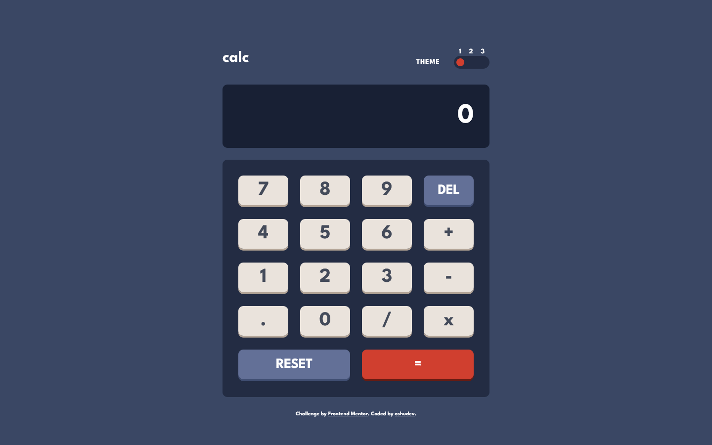

# Frontend Mentor - Calculator app solution

This is a solution to the [Calculator app challenge on Frontend Mentor](https://www.frontendmentor.io/challenges/calculator-app-9lteq5N29). Frontend Mentor challenges help you improve your coding skills by building realistic projects.

## Table of contents

-   [Overview](#overview)
    -   [The challenge](#the-challenge)
    -   [Screenshot](#screenshot)
    -   [Links](#links)
-   [My process](#my-process)
    -   [Built with](#built-with)
    -   [Continued development](#continued-development)
-   [Author](#author)

## Overview

### The challenge

Users should be able to:

-   See the size of the elements adjust based on their device's screen size
-   Perform mathmatical operations like addition, subtraction, multiplication, and division
-   Adjust the color theme based on their preference
-   Users can get floating point numbers if they do the math required to get one, but they can’t type them in yet. Add a . button and let users input decimals! Make sure you don’t let them type more than one though: 12.3.56.5. It is hard to do math on these numbers. (disable the decimal button if there’s already one in the display)

### Screenshot

### Links

-   Solution URL: [Github](https://github.com/oshudev/calculator-app)
-   Live Site URL: [Vercel](https://calculator-app-tau-weld.vercel.app)

## My process

### Built with

-   Semantic HTML5 markup
-   CSS custom properties
-   Flexbox
-   CSS Grid
-   Mobile-first workflow
-   Vanilla JS

### Continued development

-   The calculator don't handle more than 12 digits. If the result go beyond the limit of 12 digits, it will display "too large" as a message.
-   It doesn't support keyboard input.

## Author

-   Frontend Mentor - [@oshudev](https://www.frontendmentor.io/profile/oshudev)
